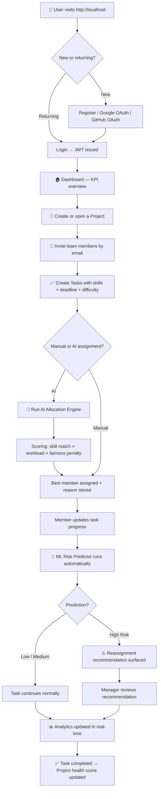
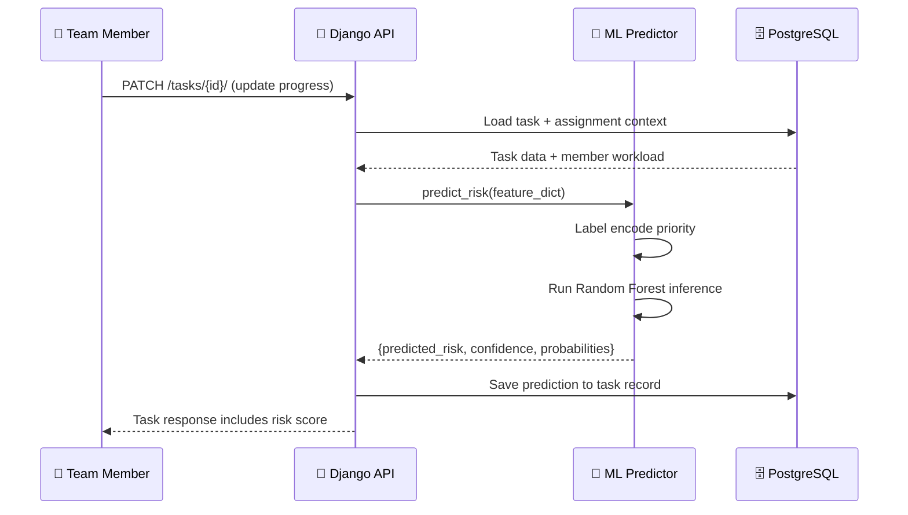
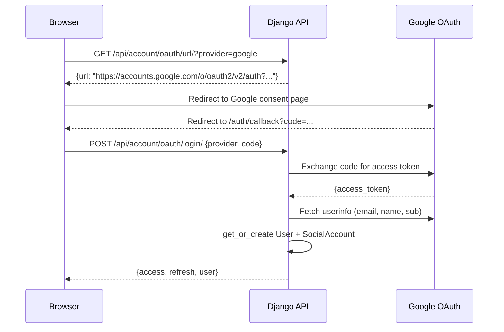
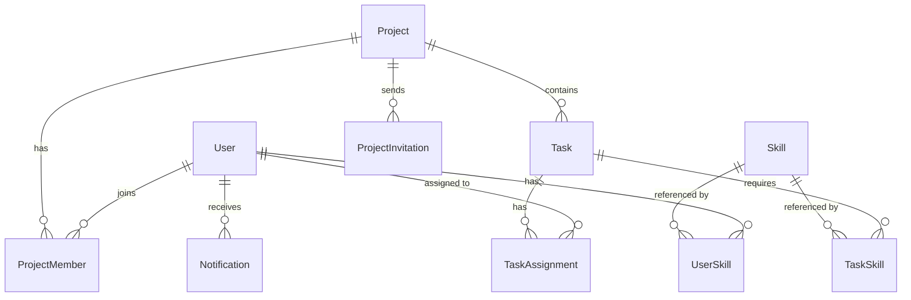
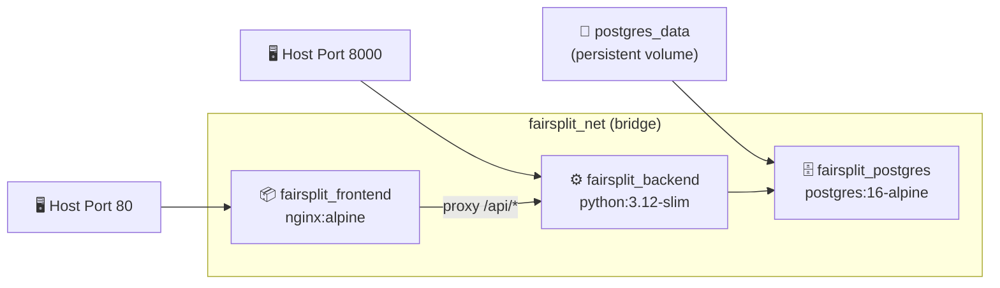

<div align="center">

# ⚖️ FairSplit

### AI-Powered Project Management with Intelligent Task Allocation & Risk Prediction

<br/>

[](https://react.dev/)
[](https://vitejs.dev/)
[](https://www.djangoproject.com/)
[](https://www.postgresql.org/)
[](https://www.docker.com/)
[](https://www.python.org/)
[](https://scikit-learn.org/)
[](./LICENSE)

<br/>

**FairSplit is a full-stack project management platform where work is never piled on one person.**
It uses a custom AI engine to assign tasks based on skill match, workload, and fairness — and a trained Machine Learning model to predict which tasks are at risk of missing their deadlines before it happens.

<br/>

[🚀 Quick Start](#-quick-start) · [🏗️ Architecture](#%EF%B8%8F-system-architecture) · [🤖 AI Engine](#-ai-allocation-engine) · [🧠 ML Prediction](#-machine-learning-risk-prediction) · [🐳 Docker](#-docker-deployment) · [📖 API Docs](#-api-overview)

</div>

---

## 📋 Table of Contents

- [About FairSplit](#-about-fairsplit)
- [Key Features](#-key-features)
- [Complete Workflow](#-complete-workflow)
- [System Architecture](#%EF%B8%8F-system-architecture)
- [AI Allocation Engine](#-ai-allocation-engine)
- [ML Risk Prediction](#-machine-learning-risk-prediction)
- [Authentication](#-authentication)
- [Database Design](#-database-design)
- [API Overview](#-api-overview)
- [Tech Stack](#-tech-stack)
- [Project Structure](#-project-structure)
- [Quick Start](#-quick-start)
- [Docker Deployment](#-docker-deployment)
- [Environment Variables](#-environment-variables)
- [OAuth Configuration](#-oauth-configuration)
- [Development Workflow](#-development-workflow)
- [Security](#-security)
- [Known Limitations](#-known-limitations)
- [Roadmap](#-roadmap)
- [Contributing](#-contributing)
- [Developer](#-developer)
- [License](#-license)

---

## 🧩 About FairSplit

### The Problem

Every software team faces the same invisible dysfunction: work is never evenly distributed.

Senior engineers get buried under the most critical tasks while others stay underutilized. Project managers make assignment decisions based on gut feel, not data. Deadlines slip not because teams lack talent, but because the wrong people are assigned to the wrong tasks at the wrong time.

Existing project management tools like Jira, Trello, and Asana are fundamentally **passive**. They track what you tell them. They don't tell you what's wrong, who's overloaded, or which task is silently heading toward a missed deadline.

### Why FairSplit Exists

FairSplit treats task allocation as an **optimization problem** — not a manual decision. It combines:

- **Skill matching** — tasks are matched to members who have the required skills at the right proficiency level.
- **Workload balancing** — no member gets buried while others are idle.
- **Fairness enforcement** — a fairness penalty prevents the same person from being auto-assigned repeatedly.
- **Predictive risk scoring** — a trained Random Forest model flags tasks that are statistically likely to miss their deadlines, before they actually do.

The result is a system that makes data-driven allocation decisions, surfaces risk proactively, and gives project managers insight into team health at a glance.

---

## ✨ Key Features

<details>
<summary><b>🔐 Authentication & Identity</b></summary>

- Email/password registration and login
- **Google OAuth 2.0** — one-click sign-in with Google
- **GitHub OAuth** — one-click sign-in with GitHub
- JWT access tokens (24-hour lifetime) + refresh tokens (7-day rotation)
- Custom `AbstractUser` model with role field (`manager` / `member`)
- Automatic social account linking via `django-allauth`

</details>

<details>
<summary><b>📁 Projects & Teams</b></summary>

- Create and manage multiple projects
- Invite members by email — invitation emails sent via Gmail SMTP
- Role-based membership: Manager vs. Member
- Invitation token system with configurable expiry
- Pending invitation processing on new user registration

</details>

<details>
<summary><b>✅ Task Management</b></summary>

- Full task lifecycle: `todo` → `in_progress` → `review` → `done`
- Task priorities: Low / Medium / High / Critical
- Task difficulty levels: Easy / Medium / Hard / Expert
- Deadline tracking with days-remaining calculation
- Estimated hours vs. actual hours tracking
- Completion percentage (0–100%) with role-based access control
- Required skills per task
- Assignment history with allocation reasoning

</details>

<details>
<summary><b>🤖 AI Task Allocation</b></summary>

- Automated assignment using a custom scoring algorithm
- Inputs: skill match, proficiency, workload score, fairness penalty
- Stores allocation confidence score and matched skills
- Generates human-readable assignment reason
- Recommends reassignment for high-risk tasks

</details>

<details>
<summary><b>🧠 ML Risk Prediction</b></summary>

- Random Forest Classifier trained on synthetic task data
- Triggered automatically on every task progress update
- Outputs: Low / Medium / High risk label + confidence percentage
- Full class probability breakdown (Low%, Medium%, High%)
- XGBoost also available in the training pipeline

</details>

<details>
<summary><b>📊 Analytics Dashboard</b></summary>

- Project-level KPI cards: total tasks, completed, in-progress, review
- Completion percentage and risk distribution charts
- Per-member workload analytics: assigned hours, actual hours, average completion
- Team-wide analytics grid
- Risk analytics: high-risk task count, average confidence, task details

</details>

<details>
<summary><b>🔔 Notifications</b></summary>

- In-app notification system
- Notification types: task assigned, invitation received, project updates
- Unread count badge in navigation
- Mark individual or all as read

</details>

<details>
<summary><b>🎨 Frontend & UX</b></summary>

- React 18 + Vite 5 single-page application
- Dark-mode–first glassmorphism UI
- Fully responsive — mobile to widescreen
- Protected routes with JWT guard
- Context-based global auth state
- Pages: Landing, Login, Register, Onboarding, Dashboard, Projects, Tasks, Teams, Analytics, Prediction, Notifications, Profile, Settings, Invite Preview

</details>

<details>
<summary><b>🐳 Docker & Deployment</b></summary>

- Production-ready `docker-compose.yml` orchestrating 3 services
- Multi-stage frontend build: Node 20 Alpine → Nginx Alpine (27.4 MB image)
- Django backend on Python 3.12-slim with Gunicorn WSGI
- PostgreSQL 16 with persistent volume and healthchecks
- Automatic migrations and `collectstatic` on container startup
- All credentials environment-variable driven via `.env`

</details>

---

## 🔄 Complete Workflow



---

## 🏗️ System Architecture

```mermaid
graph TB
    subgraph Browser["🌐 Browser (http://localhost)"]
        React["React 18 + Vite SPA"]
    end

    subgraph Docker["🐳 Docker Compose Network (fairsplit_net)"]
        Nginx["📦 Nginx Alpine\n(Port 80)\nServes SPA + Proxies /api/"]
        Gunicorn["⚙️ Gunicorn WSGI\n(Port 8000)\n4 Workers"]
        Django["🐍 Django 6.0\nREST Framework"]
        ML["🧠 ML Predictor\nRandom Forest\n(joblib model)"]
        PG["🗄️ PostgreSQL 16\n(Port 5432)\npersistent volume"]
    end

    React -->|HTTP| Nginx
    Nginx -->|Static assets| React
    Nginx -->|/api/* proxy| Gunicorn
    Gunicorn --> Django
    Django -->|ORM queries| PG
    Django -->|predict_risk()| ML
    ML -->|risk label + confidence| Django
```

### Component Breakdown

| Component | Technology | Responsibility |
|-----------|-----------|---------------|
| **SPA** | React 18 + Vite 5 | UI rendering, routing, state management |
| **Reverse Proxy** | Nginx Alpine | Serve static bundle, proxy `/api/` to Gunicorn |
| **WSGI Server** | Gunicorn 22 | Process Django HTTP requests across sync workers |
| **Application Server** | Django 6.0 + DRF | Business logic, REST APIs, authentication |
| **ML Engine** | scikit-learn / joblib | Risk prediction inference at request time |
| **Database** | PostgreSQL 16 | Persistent relational data storage |
| **Auth Provider** | SimpleJWT + allauth | JWT lifecycle, Google/GitHub OAuth flows |

---

## 🤖 AI Allocation Engine

The allocation engine lives in `backend/allocation/` and is invoked when a manager clicks **Run AI Allocation** on a project.

### How It Works

For each unassigned task in the project, the engine:

1. **Fetches all active project members** and their skills/proficiencies.
2. **Calculates a Skill Score** per member per task:

```
skill_score = sum(proficiency × importance) for each matched required skill
```

3. **Calculates a Workload Score** per member:

```
workload_score = MAX_WORKLOAD_HOURS − member's currently assigned estimated hours
```

4. **Applies a Fairness Penalty** — members who have already been auto-assigned recently receive a penalty, preventing the engine from repeatedly choosing the same high-scorer.

5. **Computes a Final Allocation Score**:

```
final_score = (0.7 × skill_score) + (0.3 × workload_score) − fairness_penalty
```

6. **Assigns the task** to the member with the highest final score and stores:
   - Confidence percentage
   - Matched skills list
   - Human-readable assignment reason

7. For tasks already assigned to a **high-risk** member, the engine surfaces a **reassignment recommendation** — the manager makes the final call.

### What Gets Stored

```python
TaskAssignment(
    task=task,
    assigned_to=best_member,
    allocation_confidence=confidence,      # e.g. 87.4%
    allocation_reason="Matched skills: Python, Django. Lowest workload.",
    matched_skills=["Python", "Django"],
    assignment_method="ai_allocation"
)
```

---

## 🧠 Machine Learning Risk Prediction

The ML pipeline lives in `backend/ml/` and runs automatically every time a team member updates their task progress.

### Model

**Random Forest Classifier** (scikit-learn) trained on a synthetic dataset of task scenarios.

### Input Features

| Feature | Description |
|---------|-------------|
| `estimated_hours` | Total hours scoped for the task |
| `difficulty` | Encoded difficulty level (1–4) |
| `priority` | Label-encoded priority (low/medium/high/critical) |
| `required_skills` | Count of required skills |
| `skill_score` | Assigned member's skill match score |
| `workload_score` | Member's available capacity score |
| `active_tasks` | Member's count of currently active tasks |
| `days_left` | Days until deadline at prediction time |
| `completion_percentage` | Current task completion (0–100) |

### Outputs

```json
{
  "predicted_risk": "High",
  "confidence": 91.25,
  "probabilities": {
    "Low": 3.50,
    "Medium": 5.25,
    "High": 91.25
  }
}
```

### Prediction Pipeline



---

## 🔐 Authentication

### Email / Password Flow

```
POST /api/account/register/  →  Create user account
POST /api/account/login/     →  Returns {access, refresh} JWT pair
POST /api/account/token/refresh/ →  Rotate refresh token
```

### Google & GitHub OAuth Flow



**JWT Configuration:**

| Setting | Value |
|---------|-------|
| Access Token Lifetime | 24 hours |
| Refresh Token Lifetime | 7 days |
| Rotate Refresh Tokens | ✅ Yes |
| Algorithm | HS256 |

---

## 🗄️ Database Design

<details>
<summary><b>Click to expand schema overview</b></summary>



### Core Tables

| Table | Key Fields | Purpose |
|-------|-----------|---------|
| `account_user` | id, email, username, role, first_name, last_name | Custom user model |
| `project_project` | id, name, description, created_by, created_at | Project records |
| `project_projectmember` | project, user, role | Team membership |
| `project_projectinvitation` | email, project, invited_by, token, status, expires_at | Email invitations |
| `tasks_task` | project, title, priority, difficulty, deadline, estimated_hours, completion_percentage, predicted_risk, risk_confidence | Task lifecycle |
| `tasks_taskassignment` | task, assigned_to, confidence, reason, matched_skills, method | AI assignment records |
| `tasks_assignmenthistory` | task, from_user, to_user, changed_by, reason | Reassignment audit trail |
| `skills_skill` | name, description | Skill catalogue |
| `skills_userskill` | user, skill, proficiency_level | Member proficiency |
| `tasks_taskskill` | task, skill, importance | Task skill requirements |
| `notifications_notification` | user, type, message, is_read, created_at | In-app notifications |

</details>

---

## 📖 API Overview

All endpoints are prefixed with `/api/`.

<details>
<summary><b>Authentication & Account</b></summary>

| Method | Endpoint | Description |
|--------|----------|-------------|
| `POST` | `/account/register/` | Register new user |
| `POST` | `/account/login/` | Login and receive JWT pair |
| `POST` | `/account/refresh/` | Refresh access token |
| `GET` / `PATCH` | `/account/profile/` | Get or update profile |
| `GET` | `/account/users/` | List active users (auth required) |
| `GET` | `/account/oauth/url/` | Get OAuth redirect URL |
| `POST` | `/account/oauth/login/` | Exchange OAuth code for JWT |

</details>

<details>
<summary><b>Projects & Member Invitations</b></summary>

| Method | Endpoint | Description |
|--------|----------|-------------|
| `GET` / `POST` | `/projects/` | List or create projects |
| `GET` / `PATCH` / `DELETE` | `/projects/{id}/` | Project detail, update, delete |
| `GET` / `POST` | `/projects/{id}/members/` | List or add project members |
| `DELETE` | `/projects/members/{id}/` | Remove project member |
| `POST` | `/projects/{id}/invite/` | Send invitation email |
| `GET` | `/projects/{id}/invitations/` | List project invitations |
| `GET` | `/invitations/{token}/` | Preview invitation token |
| `POST` | `/invitations/{token}/accept/` | Accept project invitation |
| `POST` | `/invitations/{id}/cancel/` | Cancel pending invitation |
| `POST` | `/invitations/{id}/resend/` | Resend invitation email |

</details>

<details>
<summary><b>Tasks & Allocation</b></summary>

| Method | Endpoint | Description |
|--------|----------|-------------|
| `GET` / `POST` | `/tasks/` | List or create tasks |
| `GET` / `PATCH` / `DELETE` | `/tasks/{id}/` | Task detail, update, delete |
| `PATCH` | `/tasks/{id}/progress/` | Update progress & trigger ML risk prediction |
| `GET` / `POST` | `/tasks/{id}/skills/` | Task skill requirements |
| `POST` | `/allocation/generate/{project_id}/` | Run AI task allocation engine for project |
| `GET` | `/allocation/recommend/{task_id}/` | Get AI reassignment recommendation for task |

</details>

<details>
<summary><b>Analytics & Machine Learning</b></summary>

| Method | Endpoint | Description |
|--------|----------|-------------|
| `GET` | `/analytics/project/{project_id}/` | Project KPI dashboard summary |
| `GET` | `/analytics/member/{member_id}/` | Per-member workload analytics |
| `GET` | `/analytics/team/{project_id}/` | Team-wide performance analytics |
| `GET` | `/analytics/risk/{project_id}/` | Risk distribution analytics |
| `POST` | `/ml/predict-risk/` | Run manual ML risk prediction inference |

</details>

<details>
<summary><b>Notifications & Skills</b></summary>

| Method | Endpoint | Description |
|--------|----------|-------------|
| `GET` | `/notifications/` | List user notifications |
| `GET` | `/notifications/unread-count/` | Get unread notification count |
| `POST` | `/notifications/read-all/` | Mark all notifications as read |
| `PATCH` | `/notifications/{id}/read/` | Mark single notification as read |
| `DELETE` | `/notifications/{id}/` | Delete notification |
| `GET` / `POST` | `/skills/` | Skill catalogue |
| `GET` / `POST` | `/skills/user/` | User skill proficiency list / assign |
| `PATCH` / `DELETE` | `/skills/user/{id}/` | Update or remove user skill proficiency |

</details>

---

## 🛠️ Tech Stack

### Frontend

| Technology | Version | Purpose |
|-----------|---------|---------|
| React | 19 | Component-based UI framework |
| Vite | 8 | Build tool and dev server |
| React Router | 7 | Client-side SPA routing |
| Axios | 1.18 | HTTP API client |
| Tailwind CSS | 4.3 | Utility-first styling framework |
| Framer Motion | 12.42 | UI animations |
| Lucide React | 1.25 | UI icons |

### Backend

| Technology | Version | Purpose |
|-----------|---------|---------|
| Django | 6.0.7 | Web framework |
| Django REST Framework | Latest | REST API layer |
| SimpleJWT | Latest | JWT authentication |
| django-allauth | Latest | OAuth social account management |
| django-cors-headers | Latest | CORS handling |
| python-decouple | Latest | Environment variable management |
| Gunicorn | 22.0.0 | WSGI production server |

### Machine Learning

| Technology | Purpose |
|-----------|---------|
| scikit-learn | Random Forest Classifier training & inference |
| XGBoost | Alternative gradient boosting model in training pipeline |
| pandas | Feature engineering and dataset manipulation |
| numpy | Numerical operations |
| joblib | Model serialization (`.pkl`) |

### Database & Storage

| Technology | Purpose |
|-----------|---------|
| PostgreSQL 16 | Production relational database |
| SQLite3 | Local development fallback |
| psycopg2-binary | PostgreSQL Python adapter |

### DevOps & Deployment

| Technology | Purpose |
|-----------|---------|
| Docker | Container runtime |
| Docker Compose | Multi-service orchestration |
| Nginx Alpine | Static file server + reverse proxy |
| python:3.12-slim | Backend base image |
| node:20-alpine | Frontend multi-stage build image |

---

## 📁 Project Structure

```
FairSplit/
│
├── 🐳 docker-compose.yml          # 3-service orchestration (postgres, backend, frontend)
├── 📋 .env.example                # Root environment template
├── 🚫 .dockerignore               # Docker build context exclusions
│
├── backend/                       # Django application root
│   ├── account/                   # User auth, OAuth, profile, user listing
│   ├── allocation/                # AI scoring engine + workload manager
│   ├── analytics/                 # Project, member, team, and risk analytics APIs
│   ├── backend/                   # Django project settings, URLs, WSGI
│   ├── datasets/                  # Training data CSVs for ML model
│   ├── ml/                        # ML predictor, training pipeline, serialized models
│   │   └── models/                # risk_model.pkl, encoders
│   ├── notifications/             # In-app notification models and APIs
│   ├── prediction/                # Prediction service integrating ML output with tasks
│   ├── project/                   # Project, membership, invitation models and APIs
│   │   └── services/              # email_service.py, invitation_service.py
│   ├── skills/                    # Skill catalogue and user skill proficiency
│   ├── tasks/                     # Task lifecycle, assignment, history models and APIs
│   ├── Dockerfile                 # python:3.12-slim image with Gunicorn
│   ├── .env.example               # Backend environment template
│   └── requirements.txt           # Python dependencies
│
└── frontend/                      # React application root
    ├── src/
    │   ├── components/            # Reusable UI components (navbar, modals, cards)
    │   ├── context/               # AuthContext — global auth state
    │   ├── pages/                 # Route-level pages (17 pages)
    │   │   ├── Landing.jsx        # Public landing page
    │   │   ├── Login.jsx / Register.jsx
    │   │   ├── Dashboard.jsx      # Post-login overview with KPIs
    │   │   ├── Projects.jsx       # Project list and management
    │   │   ├── ProjectDetails.jsx
    │   │   ├── Tasks.jsx          # Full task board with AI allocation
    │   │   ├── Teams.jsx          # Member management and invitation flow
    │   │   ├── Analytics.jsx      # Charts and analytics
    │   │   ├── Prediction.jsx     # AI risk prediction dashboard
    │   │   ├── Notifications.jsx
    │   │   ├── Profile.jsx
    │   │   ├── Settings.jsx
    │   │   └── AuthCallback.jsx   # OAuth code exchange handler
    │   ├── services/              # auth.service.js, api.js (Axios instance)
    │   └── utils/                 # Helper functions
    ├── nginx.conf                 # SPA routing + /api/ reverse proxy config
    ├── Dockerfile                 # Multi-stage: node:20-alpine → nginx:alpine
    └── .dockerignore
```

---

## 🚀 Quick Start

### Prerequisites

- Python 3.12+
- Node.js 20+
- PostgreSQL 16 (or Docker)

### Backend Setup

```bash
# Clone the repository
git clone https://github.com/PrakharPurwar12/FairSplit.git
cd FairSplit

# Create and activate virtual environment
python -m venv venv
source venv/bin/activate        # Linux/macOS
venv\Scripts\activate           # Windows

# Install dependencies
pip install -r backend/requirements.txt

# Configure environment
cp backend/.env.example backend/.env
# Edit backend/.env with your credentials

# Run migrations
cd backend
python manage.py migrate

# Create superuser (optional)
python manage.py createsuperuser

# Start Django development server
python manage.py runserver
```

### Frontend Setup

```bash
cd frontend

# Install Node dependencies
npm install

# Start Vite development server
npm run dev
```

The application will be available at `http://localhost:5173` (dev mode).

---

## 🐳 Docker Deployment

The entire production stack launches with a single command.

### Prerequisites

- [Docker Desktop](https://www.docker.com/products/docker-desktop/) v20.10+

### Setup

```bash
# Clone the repository
git clone https://github.com/PrakharPurwar12/FairSplit.git
cd FairSplit

# Configure credentials
cp backend/.env.example backend/.env
# Edit backend/.env — set GOOGLE_CLIENT_ID, GOOGLE_CLIENT_SECRET, EMAIL_HOST_USER, etc.
```

### Build & Launch

```bash
docker compose up -d --build
```

This command:
1. Starts **PostgreSQL 16** with healthcheck and persistent volume
2. Builds and starts **Django + Gunicorn** — runs migrations + collectstatic automatically
3. Builds a **multi-stage Nginx** image serving the React SPA
4. Connects all services on a private `fairsplit_net` bridge network

### Access Points

| Service | URL |
|---------|-----|
| **Frontend Application** | `http://localhost` |
| **Django Admin** | `http://localhost:8000/admin/` |
| **API Root** | `http://localhost/api/` |

### Common Operations

```bash
# View logs
docker compose logs -f backend
docker compose logs -f frontend

# Create Django superuser
docker compose exec backend python manage.py createsuperuser

# Database shell
docker compose exec postgres psql -U fairsplit -d fairsplit

# Stop and preserve data
docker compose down

# Stop and wipe database
docker compose down -v
```

### Docker Architecture



---

## 🔑 Environment Variables

### `backend/.env`

| Variable | Example Value | Required | Description |
|----------|--------------|----------|-------------|
| `SECRET_KEY` | `django-insecure-...` | ✅ | Django secret key |
| `DEBUG` | `True` | ✅ | Django debug mode |
| `ALLOWED_HOSTS` | `localhost,127.0.0.1` | ✅ | Comma-separated allowed hosts |
| `DB_ENGINE` | `django.db.backends.postgresql` | ✅ | Database engine |
| `POSTGRES_DB` | `fairsplit` | ✅ | PostgreSQL database name |
| `POSTGRES_USER` | `fairsplit` | ✅ | PostgreSQL username |
| `POSTGRES_PASSWORD` | `yourpassword` | ✅ | PostgreSQL password |
| `POSTGRES_HOST` | `postgres` | ✅ | PostgreSQL host (Docker: `postgres`) |
| `POSTGRES_PORT` | `5432` | ✅ | PostgreSQL port |
| `GOOGLE_CLIENT_ID` | `949...apps.googleusercontent.com` | ⚠️ | Google OAuth Client ID |
| `GOOGLE_CLIENT_SECRET` | `GOCSPX-...` | ⚠️ | Google OAuth Client Secret |
| `GOOGLE_REDIRECT_URI` | `http://localhost/auth/callback` | ⚠️ | Must match Google Cloud Console |
| `GITHUB_CLIENT_ID` | `Ov23li...` | ⚠️ | GitHub OAuth Client ID |
| `GITHUB_CLIENT_SECRET` | `b0fadb...` | ⚠️ | GitHub OAuth Client Secret |
| `EMAIL_HOST` | `smtp.gmail.com` | ⚠️ | SMTP host |
| `EMAIL_PORT` | `587` | ⚠️ | SMTP port |
| `EMAIL_HOST_USER` | `you@gmail.com` | ⚠️ | SMTP username |
| `EMAIL_HOST_PASSWORD` | `tlgn avcu rret tpay` | ⚠️ | Gmail App Password |
| `FRONTEND_URL` | `http://localhost` | ✅ | Used in invitation emails |
| `INVITATION_EXPIRY_DAYS` | `7` | ✅ | Invitation token TTL |

> ⚠️ = Required for OAuth / email features. The platform runs without them, but Google login and invitation emails will be disabled.

---

## 🔑 OAuth Configuration

### Google Cloud Console

1. Visit [Google Cloud Console → APIs & Credentials](https://console.cloud.google.com/apis/credentials)
2. Create an OAuth 2.0 Client ID → Web Application
3. Add **Authorized JavaScript origins**:
   - Docker deployment: `http://localhost`
   - Dev mode: `http://localhost:5173`
4. Add **Authorized redirect URIs**:
   - Docker deployment: `http://localhost/auth/callback`
   - Dev mode: `http://localhost:5173/auth/callback`
5. Copy Client ID and Secret to `backend/.env`

### GitHub OAuth App

1. Visit [GitHub Developer Settings → OAuth Apps](https://github.com/settings/developers)
2. Create a new OAuth App
3. Set **Callback URL**:
   - Docker: `http://localhost/auth/callback`
   - Dev: `http://localhost:5173/auth/callback`
4. Copy Client ID and Secret to `backend/.env`

---

## 🌿 Development Workflow

This project follows a **feature-branch Git workflow**:

```bash
# Start a new feature
git checkout -b feature/your-feature-name

# Work, commit, push
git add .
git commit -m "feat: description of change"
git push origin feature/your-feature-name

# Merge into main after review
git checkout main
git pull origin main
git merge feature/your-feature-name
git push origin main

# Clean up
git branch -d feature/your-feature-name
git push origin --delete feature/your-feature-name
```

### Commit Convention

```
feat:     New feature
fix:      Bug fix
docs:     Documentation only
refactor: Code restructuring
style:    Formatting, no logic change
chore:    Build process or tooling
```

---

## 🔒 Security

| Layer | Mechanism |
|-------|-----------|
| **Authentication** | JWT access + refresh tokens, automatic rotation |
| **OAuth** | Authorization code flow — secret never exposed to browser |
| **CORS** | `django-cors-headers` middleware |
| **CSRF** | `CsrfViewMiddleware` active |
| **Secrets** | All credentials in `.env` files, excluded from Git via `.gitignore` |
| **Docker** | No secrets baked into images; all values passed via `env_file` at runtime |
| **Role access** | API views enforce `IsAuthenticated`; task progress update restricted to assigned member or manager |

> [!CAUTION]
> Never commit `backend/.env` to version control. It is intentionally excluded in `.gitignore`. Use `backend/.env.example` as a template.

---

## ⚠️ Known Limitations

- **No real-time updates** — the frontend polls for notifications; WebSocket support is on the roadmap.
- **ML model trained on synthetic data** — prediction accuracy improves with real team data over time.
- **CORS is open** (`CORS_ALLOW_ALL_ORIGINS = True`) — should be scoped to specific origins in production.
- **No CI/CD pipeline yet** — deployments are manual; GitHub Actions is planned.
- **Single Gunicorn worker type** — `sync` workers are used; async workers would improve throughput under load.

---

## 🗺️ Roadmap

| Status | Feature |
|--------|---------|
| ✅ Done | Core project management |
| ✅ Done | AI task allocation engine |
| ✅ Done | ML risk prediction |
| ✅ Done | Google & GitHub OAuth |
| ✅ Done | Gmail SMTP invitation emails |
| ✅ Done | Docker production deployment |
| ✅ Done | PostgreSQL integration |
| 🔜 Planned | GitHub Actions CI/CD pipeline |
| 🔜 Planned | WebSocket real-time notifications (Django Channels) |
| 🔜 Planned | Celery + Redis for async email and background tasks |
| 🔜 Planned | Cloud deployment (Railway / Render / AWS ECS) |
| 🔜 Planned | ML model retraining pipeline on production data |
| 🔜 Planned | Explainable AI — surface why a task is high risk |
| 🔜 Planned | Kubernetes Helm chart for horizontal scaling |
| 🔜 Planned | API rate limiting and request throttling |

---

## 🤝 Contributing

Contributions are welcome. Please follow these steps:

1. **Fork** the repository
2. **Create** a feature branch: `git checkout -b feature/my-feature`
3. **Commit** your changes: `git commit -m "feat: add my feature"`
4. **Push**: `git push origin feature/my-feature`
5. Open a **Pull Request** with a clear description

Please ensure your changes don't break existing functionality and follow the existing code style.

---

## 👨‍💻 Developer

<div align="center">

**Prakhar Purwar**

*Software Developer & AI Engineer*

[](https://github.com/PrakharPurwar12)
[](mailto:purwarprakhar00@gmail.com)

</div>

---

## 🙏 Acknowledgements

- [Django](https://www.djangoproject.com/) and [Django REST Framework](https://www.django-rest-framework.org/) for the robust backend foundation
- [scikit-learn](https://scikit-learn.org/) for the ML infrastructure
- [React](https://react.dev/) and [Vite](https://vitejs.dev/) for the fast frontend toolchain
- [django-allauth](https://allauth.org/) for OAuth social authentication
- [SimpleJWT](https://django-rest-framework-simplejwt.readthedocs.io/) for JWT token lifecycle management
- The open-source community for the ecosystem that made this project possible

---

<div align="center">

**FairSplit** — because fair work distribution shouldn't require a spreadsheet.

*Built with ❤️ as an M.Tech AI Project*

</div>