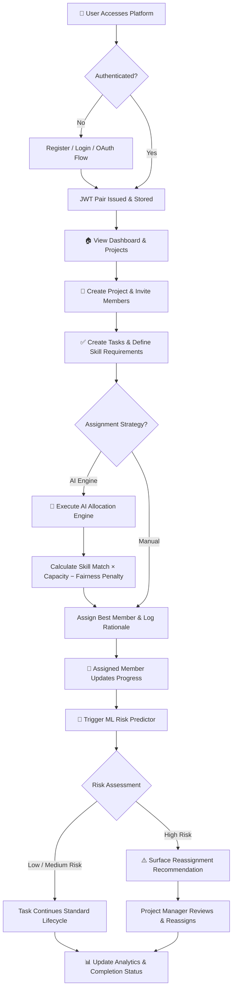
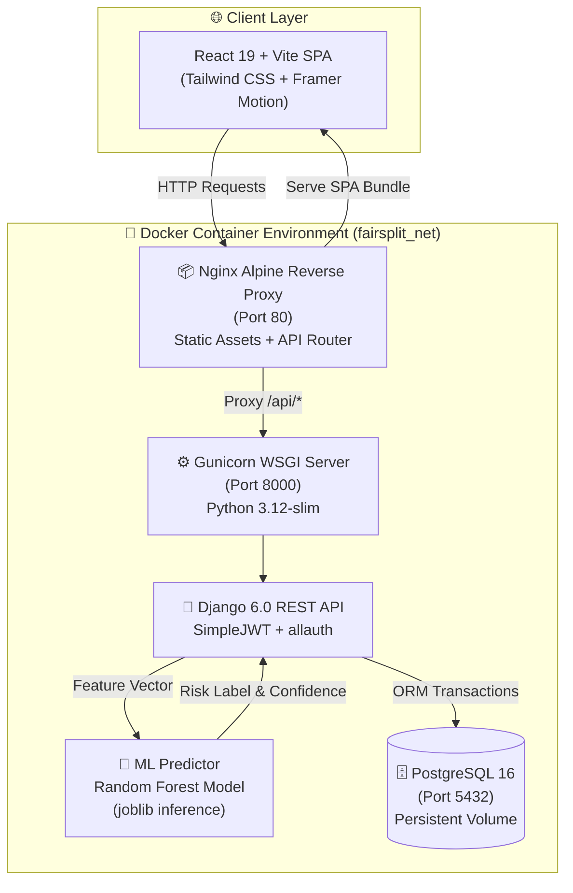
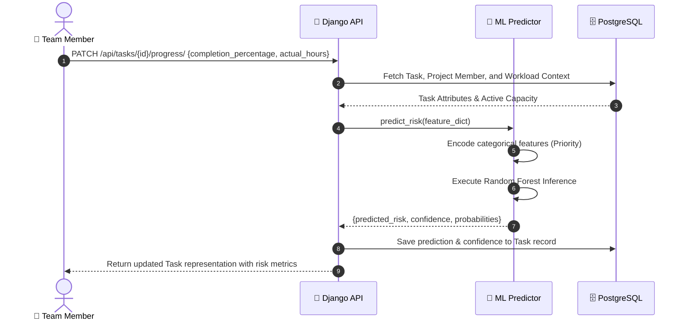
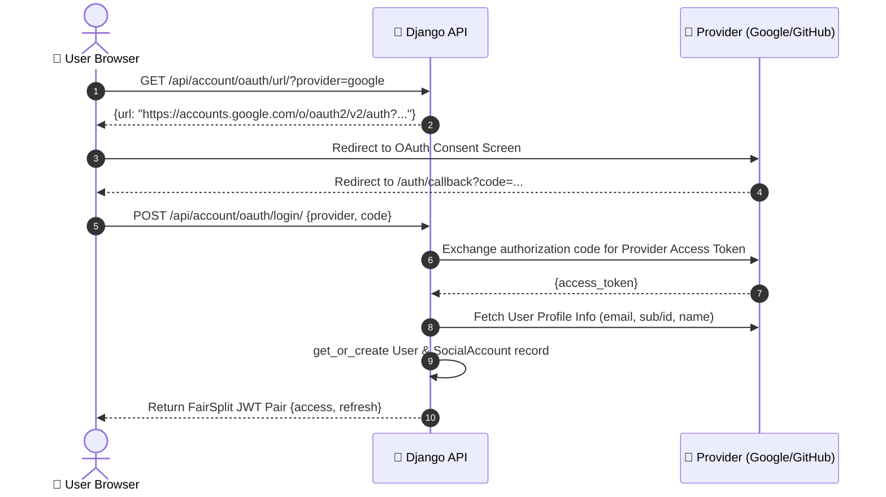
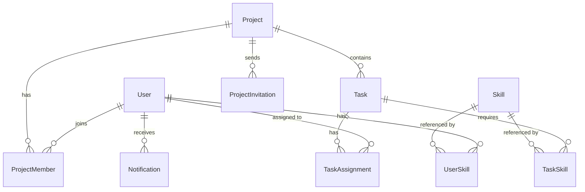
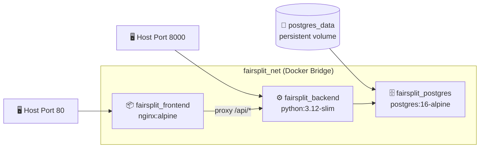

<div align="center">

# ⚖️ FairSplit

### AI-Powered Project Management & Workload Optimization Engine

<p align="center">
  <b>An open-source, full-stack project management platform that prevents team burnout through automated, skill-matched task allocation and proactive machine learning risk prediction.</b>
</p>

<br/>

[](https://react.dev/)
[](https://vitejs.dev/)
[](https://www.djangoproject.com/)
[](https://www.postgresql.org/)
[](https://www.docker.com/)
[](https://www.python.org/)
[](https://scikit-learn.org/)
[](./LICENSE)

<br/>

[🚀 Quick Start](#-quick-start) · [🏗️ Architecture](#%EF%B8%8F-system-architecture) · [🤖 AI Engine](#-ai-allocation-engine) · [🧠 ML Prediction](#-machine-learning-risk-prediction) · [🐳 Docker](#-docker-deployment) · [📖 API Docs](#-api-overview) · [❓ FAQ](#-frequently-asked-questions)

<br/>

</div>

---

### 🌟 Project Highlights

| 🤖 Smart Task Allocation | 🧠 Predictive ML Risk Scoring | 🐳 Production Containerized |
| :--- | :--- | :--- |
| Optimizes task distribution using a multi-factor algorithm considering skill proficiency, member capacity, and fairness penalties. | Flags tasks at risk of missing deadlines before failure using a trained Random Forest classifier triggered on progress updates. | Fully orchestrates Nginx Alpine, Gunicorn WSGI, Django REST Framework, and PostgreSQL 16 using Docker Compose. |

---

## 📊 System Metrics & Scale

| Metric | Value | Technology / Details |
| :--- | :---: | :--- |
| **Frontend SPA Pages** | **17** | React 19 + React Router 7 (Dashboard, Projects, Tasks, Analytics, etc.) |
| **REST API Endpoints** | **30+** | Django REST Framework + SimpleJWT + allauth |
| **Containerized Services** | **3** | Nginx (`fairsplit_frontend`), Gunicorn (`fairsplit_backend`), Postgres (`fairsplit_postgres`) |
| **ML Inference Model** | **1** | Random Forest Classifier (`risk_model.pkl`) + scikit-learn encoders |
| **Authentication Methods** | **3** | JWT (Email/Password), Google OAuth 2.0, GitHub OAuth |
| **Database Tables** | **11** | PostgreSQL 16 / SQLite3 relational schema |

---

## 📋 Table of Contents

- [About FairSplit](#-about-fairsplit)
- [Feature Matrix](#-feature-matrix)
- [Key Features](#-key-features)
- [Complete Workflow](#-complete-workflow)
- [System Architecture](#%EF%B8%8F-system-architecture)
- [AI Allocation Engine](#-ai-allocation-engine)
- [Machine Learning Risk Prediction](#-machine-learning-risk-prediction)
- [Authentication Architecture](#-authentication-architecture)
- [Database Schema](#-database-schema)
- [API Overview](#-api-overview)
- [Tech Stack](#-tech-stack)
- [Project Structure](#-project-structure)
- [Quick Start](#-quick-start)
- [Docker Deployment](#-docker-deployment)
- [Environment Variables](#-environment-variables)
- [OAuth Configuration](#-oauth-configuration)
- [Development & Git Workflow](#-development--git-workflow)
- [Security Implementation](#-security-implementation)
- [UI Gallery](#-ui-gallery)
- [Architecture & Design Q&A](#-architecture--design-qa)
- [Known Limitations](#-known-limitations)
- [Roadmap](#-roadmap)
- [Frequently Asked Questions](#-frequently-asked-questions)
- [Developer](#-developer)
- [License](#-license)

---

## 🧩 About FairSplit

### The Problem

In software development teams, work distribution is rarely balanced. 

Senior engineers are frequently overloaded with critical tasks while junior or newly onboarded members remain underutilized. Project managers make assignment decisions manually based on immediate availability or gut feeling, leading to:

1. **Member Burnout**: Over-assignment of high-impact tasks to the same team members.
2. **Skill Mismatch**: Tasks assigned without systematically evaluating required skill proficiencies.
3. **Reactive Problem Solving**: Project risks are identified only after deadlines have already passed.

Existing project management platforms (e.g. Jira, Trello) are **passive tools** — they store and display status updates entered by users, but do not actively optimize workload distribution or predict delivery risks.

### Why FairSplit Exists

FairSplit treats task assignment as a **data-driven optimization problem**. It combines algorithmic task allocation with machine learning risk inference to solve team imbalance:

- **Skill Match Scoring**: Evaluates member proficiencies against task requirements.
- **Capacity & Workload Balancing**: Calculates remaining hours to prevent member overloading.
- **Fairness Enforcement**: Applies dynamic penalties to avoid repeating auto-assignments to the same member.
- **Preemptive Risk Detection**: Predicts completion risk (Low, Medium, High) with confidence metrics whenever task progress changes.

> [!NOTE]
> FairSplit does not replace project managers; it provides actionable recommendations, allocation confidence metrics, and automated risk alerts to support decision-making.

---

## ⚡ Feature Matrix

| Module | Status | Core Implementation Details |
| :--- | :---: | :--- |
| **Email/Password Auth** | ✅ Active | Django REST Framework + SimpleJWT (`/api/account/login/`) |
| **Google OAuth 2.0** | ✅ Active | `django-allauth` integration + authorization code flow |
| **GitHub OAuth** | ✅ Active | `django-allauth` integration + authorization code flow |
| **Projects & Members** | ✅ Active | Multi-project workspace, role management (Manager / Member) |
| **Email Invitations** | ✅ Active | Gmail SMTP backend + secure invitation tokens |
| **Task Board** | ✅ Active | Kanban states (`todo`, `in_progress`, `review`, `done`), priority, difficulty |
| **AI Task Allocation** | ✅ Active | Multi-factor scoring algorithm (`backend/allocation/`) |
| **ML Risk Prediction** | ✅ Active | Random Forest Classifier (`backend/ml/predictor.py`) |
| **Analytics Dashboard** | ✅ Active | Project KPIs, member workload, risk distributions |
| **In-App Notifications** | ✅ Active | REST notification center, unread count, read states |
| **Docker Compose** | ✅ Active | 3-service deployment (Nginx, Gunicorn, PostgreSQL 16) |

---

## ✨ Key Features

<details>
<summary><b>🔐 Authentication & Identity Management</b></summary>

- Standard Email/Password registration and login.
- **Google OAuth 2.0** & **GitHub OAuth** integration via authorization code exchange.
- JWT authentication (`access` token valid for 24h, `refresh` token valid for 7d with rotation).
- Role-based permissions (`manager` vs `member`).
- Automatic account creation and social account linking via `django-allauth`.

</details>

<details>
<summary><b>📁 Projects & Team Management</b></summary>

- Multi-project creation and management.
- Team member invitations sent via Django SMTP (Gmail backend).
- Configurable invitation token expiration (`INVITATION_EXPIRY_DAYS`).
- Automatic matching and processing of pending project invitations upon new user registration.

</details>

<details>
<summary><b>✅ Task Management & Lifecycle</b></summary>

- Kanban workflow states: `todo` → `in_progress` → `review` → `done`.
- Task Priorities: `Low`, `Medium`, `High`, `Critical`.
- Task Difficulties: `Easy`, `Medium`, `Hard`, `Expert`.
- Estimated vs. actual hours tracking.
- Completion percentage tracking (0–100%) with role-scoped update controls.
- Required skill tagging with importance weighting.
- Full audit history of task assignments and reassignments.

</details>

<details>
<summary><b>🤖 AI Task Allocation Engine</b></summary>

- Programmatic task allocation based on multi-factor scoring.
- Evaluates skill proficiency, active workload capacity, and historical assignment count.
- Stores allocation confidence score and human-readable assignment rationale.
- Recommends optimal team members for task reassignment.

</details>

<details>
<summary><b>🧠 Machine Learning Risk Prediction</b></summary>

- Trained **Random Forest Classifier** predicting delivery risk (`Low`, `Medium`, `High`).
- Inference triggered on every task progress update (`PATCH /api/tasks/{id}/progress/`).
- Returns risk label, confidence percentage, and class probability distribution.
- XGBoost comparison pipeline included in model training script (`backend/ml/train.py`).

</details>

<details>
<summary><b>📊 Analytics & Performance Metrics</b></summary>

- Project dashboard metrics: total tasks, completed, in-progress, review.
- Per-member workload breakdown: assigned hours, actual hours, completion rates.
- Risk analytics detailing high-risk tasks and average prediction confidence.

</details>

<details>
<summary><b>🔔 Notifications Center</b></summary>

- Notification tracking for task assignments, project invites, and role updates.
- API endpoints for unread counts, marking single/all as read, and deletion.

</details>

<details>
<summary><b>🐳 Docker Deployment</b></summary>

- Single-command orchestration via `docker-compose.yml`.
- Multi-stage frontend image (`node:20-alpine` → `nginx:alpine`, 27.4 MB footprint).
- Django backend running on `python:3.12-slim` via Gunicorn WSGI.
- PostgreSQL 16 with data persistence and container healthchecks.

</details>

---

## 🔄 Complete Workflow



---

## 🏗️ System Architecture



### Component Architecture Summary

| Layer | Component | Technology | Responsibility |
| :--- | :--- | :--- | :--- |
| **Frontend** | Single Page App | React 19, Vite 8, React Router 7 | User interface, state management, routing |
| **Proxy** | Reverse Proxy | Nginx Alpine | Static asset hosting, routing `/api/` traffic |
| **WSGI** | App Gateway | Gunicorn 22.0.0 | WSGI worker management for Django |
| **Backend** | REST Service | Django 6.0, DRF | Authentication, project domain logic, APIs |
| **Machine Learning** | Inference Engine | scikit-learn, joblib | Real-time risk scoring using trained model |
| **Database** | Primary Store | PostgreSQL 16 / SQLite3 | Relational storage for users, tasks, and analytics |

---

## 🤖 AI Allocation Engine

The task allocation module (`backend/allocation/`) programmatically identifies the optimal team member for unassigned tasks.

```
       Skill Score = ∑ (Member Skill Proficiency × Task Skill Importance)
    Workload Score = Max Workload Capacity − Member Assigned Hours
      Fairness Fee = Dynamic Penalty based on Recent Auto-Assignments

  Final Score = (0.7 × Skill Score) + (0.3 × Workload Score) − Fairness Fee
```

### Allocation Pipeline

1. **Skill Matrix Evaluation**: Scans required skills for a task and computes a weighted proficiency score for each active project member.
2. **Workload Analysis**: Queries `TaskAssignment` records to sum assigned hours per member, deriving available capacity (`WorkloadManager`).
3. **Fairness Penalty Application**: Subtracts points for members who have received consecutive auto-assignments to prevent over-allocation.
4. **Assignment Execution**: Assigns the member with the highest final score, recording the confidence percentage, matched skill list, and human-readable reasoning.

---

## 🧠 Machine Learning Risk Prediction

The ML module (`backend/ml/`) evaluates task delivery risks whenever a team member updates task progress (`PATCH /api/tasks/{id}/progress/`).

> [!IMPORTANT]
> The model evaluates task execution metrics dynamically. High estimated hours combined with low completion percentage and tight deadlines increase the probability of a `High` risk classification.

### Feature Pipeline



### Model Feature Schema

| Input Feature | Data Type | Description |
| :--- | :--- | :--- |
| `estimated_hours` | Float | Total hours scoped for task completion |
| `difficulty` | Integer | Encoded task difficulty (1 = Easy, 4 = Expert) |
| `priority` | String | Label-encoded priority (`low`, `medium`, `high`, `critical`) |
| `required_skills` | Integer | Total count of required skills for task |
| `skill_score` | Float | Assigned member's skill match score |
| `workload_score` | Float | Assigned member's current available capacity |
| `active_tasks` | Integer | Count of tasks currently assigned to member |
| `days_left` | Integer | Remaining days until deadline |
| `completion_percentage` | Float | Current progress percentage (0–100) |

---

## 🔐 Authentication Architecture

FairSplit supports standard credential authentication and OAuth 2.0 social login.



> [!TIP]
> JWT Access Tokens expire in **24 hours**, while Refresh Tokens expire in **7 days**. Refresh tokens rotate automatically on use.

---

## 🗄️ Database Schema



---

## 📖 API Overview

All API endpoints are prefixed with `/api/`.

<details>
<summary><b>1. Authentication & Account APIs</b></summary>

| Method | Endpoint | Description | Auth Required |
| :--- | :--- | :--- | :---: |
| `POST` | `/api/account/register/` | Register new user account | No |
| `POST` | `/api/account/login/` | Obtain JWT access/refresh token pair | No |
| `POST` | `/api/account/refresh/` | Refresh expired JWT access token | No |
| `GET` / `PATCH` | `/api/account/profile/` | Retrieve or update user profile | Yes |
| `GET` | `/api/account/users/` | List active workspace users | Yes |
| `GET` | `/api/account/oauth/url/` | Generate Google/GitHub OAuth URL | No |
| `POST` | `/api/account/oauth/login/` | Exchange OAuth code for JWT pair | No |

</details>

<details>
<summary><b>2. Project & Team Management APIs</b></summary>

| Method | Endpoint | Description | Auth Required |
| :--- | :--- | :--- | :---: |
| `GET` / `POST` | `/api/projects/` | List user projects or create project | Yes |
| `GET` / `PATCH` / `DELETE` | `/api/projects/{id}/` | Retrieve, update, or delete project | Yes |
| `GET` / `POST` | `/api/projects/{id}/members/` | List or add project members | Yes |
| `DELETE` | `/api/projects/members/{id}/` | Remove member from project | Yes |
| `POST` | `/api/projects/{id}/invite/` | Send email invitation | Yes |
| `GET` | `/api/projects/{id}/invitations/` | List pending invitations for project | Yes |
| `GET` | `/api/invitations/{token}/` | Preview invitation token details | No |
| `POST` | `/api/invitations/{token}/accept/` | Accept invitation token | Yes |
| `POST` | `/api/invitations/{id}/cancel/` | Cancel pending invitation | Yes |
| `POST` | `/api/invitations/{id}/resend/` | Resend invitation email | Yes |

</details>

<details>
<summary><b>3. Task Management & AI Allocation APIs</b></summary>

| Method | Endpoint | Description | Auth Required |
| :--- | :--- | :--- | :---: |
| `GET` / `POST` | `/api/tasks/` | List tasks or create task | Yes |
| `GET` / `PATCH` / `DELETE` | `/api/tasks/{id}/` | Retrieve, update, or delete task | Yes |
| `PATCH` | `/api/tasks/{id}/progress/` | Update progress & trigger ML risk prediction | Yes |
| `GET` / `POST` | `/api/tasks/{id}/skills/` | Manage required skills for task | Yes |
| `POST` | `/api/allocation/generate/{project_id}/` | Run AI task allocation engine | Yes |
| `GET` | `/api/allocation/recommend/{task_id}/` | Get AI reassignment recommendation | Yes |

</details>

<details>
<summary><b>4. Analytics & Machine Learning APIs</b></summary>

| Method | Endpoint | Description | Auth Required |
| :--- | :--- | :--- | :---: |
| `GET` | `/api/analytics/project/{project_id}/` | Fetch project dashboard KPIs | Yes |
| `GET` | `/api/analytics/member/{member_id}/` | Fetch individual member analytics | Yes |
| `GET` | `/api/analytics/team/{project_id}/` | Fetch team workload distribution | Yes |
| `GET` | `/api/analytics/risk/{project_id}/` | Fetch risk analytics & distributions | Yes |
| `POST` | `/api/ml/predict-risk/` | Execute manual risk model inference | Yes |

</details>

<details>
<summary><b>5. Notifications & Skill Management APIs</b></summary>

| Method | Endpoint | Description | Auth Required |
| :--- | :--- | :--- | :---: |
| `GET` | `/api/notifications/` | List user notifications | Yes |
| `GET` | `/api/notifications/unread-count/` | Get unread notification count | Yes |
| `POST` | `/api/notifications/read-all/` | Mark all notifications as read | Yes |
| `PATCH` | `/api/notifications/{id}/read/` | Mark single notification as read | Yes |
| `DELETE` | `/api/notifications/{id}/` | Delete notification | Yes |
| `GET` / `POST` | `/api/skills/` | List or create skills in catalogue | Yes |
| `GET` / `POST` | `/api/skills/user/` | List or assign user skills | Yes |
| `PATCH` / `DELETE` | `/api/skills/user/{id}/` | Update or remove user skill proficiency | Yes |

</details>

---

## 🛠️ Tech Stack

```text
Frontend           Backend             Database            Containerization
┌──────────────┐   ┌──────────────┐    ┌──────────────┐    ┌──────────────┐
│ React 19     │   │ Django 6.0   │    │ PostgreSQL16 │    │ Docker       │
│ Vite 8       │   │ Django REST  │    │ SQLite3      │    │ Docker       │
│ ReactRouter7 │   │ SimpleJWT    │    └──────────────┘    │ Compose      │
│ Tailwind CSS │   │ Gunicorn 22  │    Machine Learning    │ Nginx Alpine │
└──────────────┘   └──────────────┘    ┌──────────────┐    └──────────────┘
                                       │ scikit-learn │
                                       │ pandas/numpy │
                                       └──────────────┘
```

---

## 📁 Project Structure

```text
FairSplit/
├── docker-compose.yml          # Production orchestration (3 services)
├── .env.example                # Root environment configuration template
├── .dockerignore               # Global Docker context exclusions
│
├── backend/                    # Django Application Root
│   ├── account/                # User authentication, profiles, OAuth
│   ├── allocation/             # AI task allocation engine
│   ├── analytics/              # Project, member, team, & risk analytics
│   ├── backend/                # Project settings, URLs, WSGI
│   ├── ml/                     # ML predictor, training code, .pkl models
│   ├── notifications/          # In-app notifications service
│   ├── project/                # Projects, members, email invitations
│   ├── skills/                 # Skill catalogue and proficiencies
│   ├── tasks/                  # Task lifecycle & assignment history
│   ├── Dockerfile              # python:3.12-slim WSGI container
│   ├── .env.example            # Backend environment template
│   └── requirements.txt        # Python backend dependencies
│
└── frontend/                   # React Application Root
    ├── src/
    │   ├── components/         # Reusable UI elements (Navbar, Cards, Modals)
    │   ├── context/            # Global AuthContext
    │   ├── pages/              # 17 SPA Pages (Dashboard, Projects, Tasks, etc.)
    │   ├── services/           # Axios instance & API services
    │   └── utils/              # Helper utilities
    ├── nginx.conf              # SPA routing & API reverse proxy configuration
    ├── Dockerfile              # Multi-stage build (Node 20 → Nginx Alpine)
    └── package.json            # Frontend dependencies
```

---

## 🚀 Quick Start

### Local Development Setup

```bash
# 1. Clone repository
git clone https://github.com/PrakharPurwar12/FairSplit.git
cd FairSplit

# 2. Setup Backend Virtual Environment
python -m venv venv
source venv/bin/activate        # On Windows: venv\Scripts\activate
pip install -r backend/requirements.txt

# 3. Configure Backend Environment
cp backend/.env.example backend/.env

# 4. Execute Migrations & Start Server
cd backend
python manage.py migrate
python manage.py runserver 8000

# 5. Setup & Start Frontend (in new terminal)
cd frontend
npm install
npm run dev
```

The dev server will start at `http://localhost:5173`.

---

## 🐳 Docker Deployment

To launch the complete FairSplit stack via Docker:

```bash
# 1. Copy environment template
cp backend/.env.example backend/.env

# 2. Build and launch all services
docker compose up -d --build
```



### Docker Verification Commands

```bash
# Check container health status
docker compose ps

# View backend logs
docker compose logs -f backend

# Create Django superuser inside backend container
docker compose exec backend python manage.py createsuperuser
```

---

## 🔑 Environment Variables

| Variable | Example Value | Description |
| :--- | :--- | :--- |
| `SECRET_KEY` | `django-insecure-...` | Django secret key |
| `DEBUG` | `False` | Toggle debug mode |
| `ALLOWED_HOSTS` | `localhost,127.0.0.1,backend` | Allowed HTTP hosts |
| `DB_ENGINE` | `django.db.backends.postgresql` | Database engine (`sqlite3` or `postgresql`) |
| `POSTGRES_DB` | `fairsplit` | PostgreSQL database name |
| `POSTGRES_USER` | `fairsplit` | PostgreSQL database user |
| `POSTGRES_PASSWORD` | `fairsplit_password` | PostgreSQL database password |
| `POSTGRES_HOST` | `postgres` | Database host inside Docker network |
| `POSTGRES_PORT` | `5432` | Database port |
| `GOOGLE_CLIENT_ID` | `949...apps.googleusercontent.com` | Google OAuth Client ID |
| `GOOGLE_CLIENT_SECRET` | `GOCSPX-...` | Google OAuth Client Secret |
| `GOOGLE_REDIRECT_URI` | `http://localhost/auth/callback` | Authorized OAuth Redirect URI |
| `GITHUB_CLIENT_ID` | `Ov23li...` | GitHub OAuth Client ID |
| `GITHUB_CLIENT_SECRET` | `b0fadb...` | GitHub OAuth Client Secret |
| `EMAIL_HOST_USER` | `you@gmail.com` | Gmail SMTP Username |
| `EMAIL_HOST_PASSWORD` | `app_password_here` | Gmail App Password |
| `FRONTEND_URL` | `http://localhost` | Client URL used in invitation links |

---

## 🔑 OAuth Configuration

### Google Cloud Console Setup

1. Open [Google Cloud Console → Credentials](https://console.cloud.google.com/apis/credentials).
2. Create an **OAuth 2.0 Client ID** (Web Application).
3. Set **Authorized JavaScript origins**: `http://localhost`
4. Set **Authorized redirect URIs**: `http://localhost/auth/callback`
5. Copy Client ID and Client Secret into `backend/.env`.

---

## 🌿 Development & Git Workflow

This project follows a feature-branch workflow:

```bash
# 1. Create feature branch
git checkout -b feature/allocation-enhancements

# 2. Commit changes using structured conventions
git commit -m "feat(allocation): add workload penalty weighting"

# 3. Push and merge to main
git push origin feature/allocation-enhancements
```

---

## 🔒 Security Implementation

> [!CAUTION]
> Credentials should never be committed to Git. `backend/.env` is strictly excluded in `.gitignore`.

- **Token Security**: Short-lived JWT access tokens (24h) combined with rotating refresh tokens (7d).
- **OAuth Safety**: OAuth authorization codes are exchanged server-side; client secrets remain enclosed within the backend environment.
- **ORM Protection**: Django ORM parameterized queries prevent SQL injection vulnerabilities.

---

## 🖼️ UI Gallery

*(Screenshots can be added by placing images into `docs/screenshots/`)*

| Landing Page | Dashboard Overview |
| :---: | :---: |
|  |  |

| Task Management Board | ML Risk Prediction |
| :---: | :---: |
|  |  |

---

## 💡 Architecture & Design Q&A

<details>
<summary><b>Q: Why use a combined skill score and workload score instead of purely assigning by availability?</b></summary>

> Assigning tasks purely by availability leads to severe skill mismatches, where complex backend tasks get assigned to available members who lack the necessary domain skills. FairSplit's weighted scoring (`0.7 × Skill Match + 0.3 × Capacity − Fairness Fee`) ensures tasks go to qualified members while remaining mindful of capacity.

</details>

<details>
<summary><b>Q: How does the ML Risk Predictor operate without locking database writes?</b></summary>

> Risk evaluation occurs asynchronously during progress updates. The feature extraction pipeline extracts numerical properties, passes them to the in-memory scikit-learn model, and writes risk labels directly back to the task instance in a single atomic database operation.

</details>

---

## ⚠️ Known Limitations

- **Polling Notifications**: Notification status updates rely on periodic client requests; WebSocket infrastructure is queued for future releases.
- **Dataset Scale**: ML model is trained on synthetic project task distributions; model accuracy will continuously scale with real workspace data.

---

## 🗺️ Roadmap

- [x] Multi-tenant project workspace management
- [x] AI Task Allocation Engine
- [x] Machine Learning Risk Predictor
- [x] Google & GitHub OAuth Integration
- [x] Docker & Docker Compose Containerization
- [ ] WebSocket integration (Django Channels) for instant notification push
- [ ] Async background queueing via Celery & Redis
- [ ] Automated CI/CD deployment pipelines via GitHub Actions

---

## ❓ Frequently Asked Questions

<details>
<summary><b>Can FairSplit run without Docker?</b></summary>

> Yes. You can run Django using SQLite3 locally alongside Vite dev server. Refer to the [Quick Start](#-quick-start) section.

</details>

<details>
<summary><b>What happens if a task requires a skill no team member possesses?</b></summary>

> The allocation engine evaluates all active members, assigns the task to the member with the highest relative capacity, and surfaces a low allocation confidence metric alongside explanatory notes in the assignment history.

</details>

---

## 👨‍💻 Developer

<div align="center">

**Prakhar Purwar**  
*Software Developer & AI Engineer*

[](https://github.com/PrakharPurwar12)
[](mailto:purwarprakhar00@gmail.com)

</div>

---

## 📄 License

This project is licensed under the [MIT License](./LICENSE).

---

<div align="center">

**FairSplit** — Data-Driven Workload Optimization for Modern Teams.

</div>